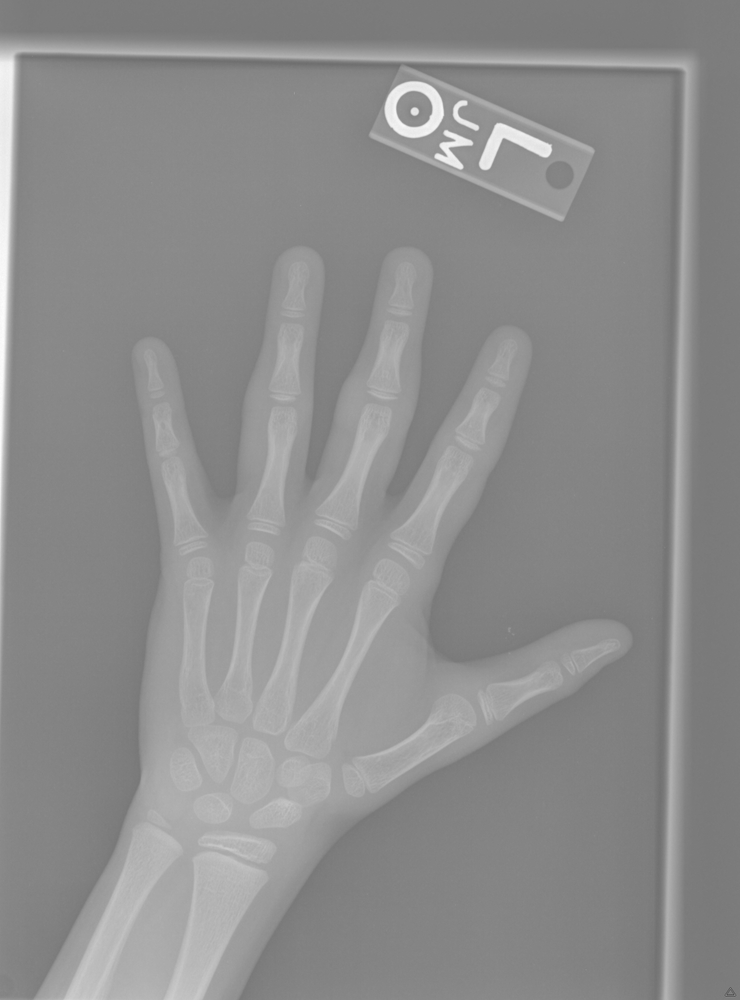

# Hand Bone Age Estimation

> **좌측 수부 X-ray 기반 골연령(Bone Age) 예측 AI**  
> YOLOX-S 기반 손 검출, DeepLabV3 기반 손 영역 분할, PCA 기반 방향 정렬, Masked Percentile 전처리와 ConvNeXt V1-Tiny + Sex-specific Label Distribution Learning을 결합한 end-to-end 골연령 예측 프로젝트입니다.

<p align="center">
  
</p>

## Portfolio
[View Project Presentation](docs/hand_bone_age_portfolio.pdf)

## Final Performance

| Metric | Held-out Test |
|---|---:|
| **N** | **197** |
| **MAE** | **4.245 months** |
| **RMSE** | **5.412 months** |
| **R²** | **0.9837** |
| **Bias** | **+0.794 months** |
| Median AE | 3.279 months |
| P90 AE | 8.688 months |
| P95 AE | 10.452 months |
| Max AE | 17.581 months |

> Held-out test는 **모델 선택이 완료된 이후 최종 성능 기록을 위해 1회 평가**했으며, 모델/하이퍼파라미터 선택에는 사용하지 않았습니다.

---

## 1. Project Overview

소아 골연령 평가는 성장 상태와 골격 성숙도를 판단하는 데 활용됩니다.  
이 프로젝트에서는 수부 X-ray의 촬영 위치, 회전, 명암, 배경 차이를 줄이고, 성별에 따른 골격 발달 차이를 모델에 반영하는 것을 목표로 했습니다.

최종 파이프라인은 다음과 같습니다.

```text
Raw Left-hand X-ray
        ↓
YOLOX-S Hand Detection
        ↓
DeepLabV3-MobileNetV3-Large Segmentation
        ↓
PCA + Finger/Wrist Direction Alignment
        ↓
Native Masked Percentile (P1-P99)
        ↓
Mask Dilation + Background Removal
        ↓
512×512 Standardized Input
        ↓
ConvNeXt V1-Tiny
        ↓
Image Feature 512 + Sex Embedding 32
        ↓
Fusion Feature 128
        ↓
Male / Female Separate 240-bin LDL Head
        ↓
Expected Bone Age (months)
```

---

## 2. Spatial Input Standardization

수부 X-ray의 촬영 방향과 배경 차이를 그대로 학습시키기보다, 모델에 입력되기 전에 손의 위치와 방향을 표준화했습니다.

<p align="center">
  
  
  
  
  
  
</p>

### 2.1 Hand Detection — YOLOX-S

YOLOX-S를 이용해 수부 영역을 검출하고 segmentation 입력용 ROI를 추출했습니다.

| Metric | Result |
|---|---:|
| mAP@0.5:0.95 | **99.4%** |
| AP@0.5 | **100.0%** |

관련 코드:

```text
src/detection/yolox_s_hand_exp.py
```

### 2.2 Hand Segmentation

DeepLabV3-MobileNetV3-Large를 사용해 손 foreground mask를 생성했습니다.

| Metric | Result |
|---|---:|
| Dice | **98.67%** |
| IoU | **97.38%** |

관련 코드:

```text
src/segmentation/train_hand_segmentation.py
```

### 2.3 PCA-based Alignment

Segmentation mask의 foreground 좌표로 PCA 주축을 추정한 뒤, finger/wrist 방향을 추가로 확인하여 손의 방향을 정렬했습니다.

```text
src/preprocessing/create_seg_aligned_dataset.py
```

이 단계의 출력은 intensity normalization을 적용하지 않은 **native-resolution aligned image + mask**입니다.

### 2.4 Final 512×512 Input

정렬된 손 영상에 다음 전처리를 적용했습니다.

1. Native segmentation foreground 내부에서 **P1 / P99** 계산
2. P1~P99 범위를 기준으로 intensity를 0~255로 선형 정규화
3. Aspect ratio 유지 후 **512×512 resize + center padding**
4. 최종 mask를 약 **3 px dilation**
5. Dilated mask 밖 background를 **0**으로 제거

```text
src/preprocessing/create_final_512_input.py
```

배경 제거는 단독 성능 향상 기법이라기보다, 촬영 환경에 따른 비수부 영역의 영향을 줄이고 입력 형식을 일관되게 유지하기 위한 최종 표준화 단계로 사용했습니다.

---

## 3. Bone Age Prediction Model

### Backbone

최종 backbone은 **ConvNeXt V1-Tiny (`convnext_tiny.fb_in1k`)** 입니다.

최종 모델 입력은 grayscale 이미지를 동일 값의 RGB 3채널로 반복하여 사용합니다.

```text
512×512 Input
    ↓
ConvNeXt V1-Tiny
    ↓
Image Feature: 512-d
```

### Sex Embedding & Feature Fusion

성별 값은 단순 one-hot concatenation이 아니라 embedding을 통해 feature로 변환합니다.

```text
Image Feature 512-d
        +
Sex Embedding 32-d
        ↓
Fusion Feature 128-d
```

### Sex-specific LDL Head

Fusion feature는 성별에 따라 별도의 240-bin head로 전달됩니다.

```text
Male   → Male 240-bin Head
Female → Female 240-bin Head
```

각 bin은 **1~240 months**를 나타내며, 최종 골연령은 예측 확률분포의 기대값으로 계산합니다.

\[
E[\mathrm{Age}] = \sum_{i=1}^{240} p_i \cdot age_i
\]

---

## 4. Label Distribution Learning

일반 scalar regression은 하나의 나이 값만 직접 예측하지만, LDL은 정답 월령 주변에도 확률을 분배하여 **연령의 연속성과 불확실성**을 함께 학습합니다.

정답 월령 \(y\)에 대해 Gaussian target distribution을 구성합니다.

- Number of bins: **240**
- Range: **1–240 months**
- Gaussian sigma: **10**
- KL weight: **0.025**

최종 학습 loss는 다음과 같습니다.

\[
\mathcal{L}
=
\mathrm{MAE}_{month}
+
0.025 \times
D_{KL}(G \parallel P)
\]

즉, 실제 골연령 값의 절대오차를 최소화하면서 예측 분포가 정답 주변의 target distribution을 따르도록 학습합니다.

관련 코드:

```text
src/bone_age/train_bone_age_ldl.py
```

---

## 5. Subgroup Error Analysis & Bias Refinement

전체 validation MAE만 확인하지 않고 **성별 × 연령 구간**으로 오류를 분석했습니다.

분석 결과, 저연령 남아에서 상대적으로 큰 positive bias가 확인되었습니다.  
이를 보완하기 위해 전체 모델을 다시 학습하지 않고 **Male LDL head만 targeted fine-tuning**했습니다.

### Trainable Scope

```text
Frozen
├─ ConvNeXt backbone
├─ image_head
├─ sex_embedding
├─ fusion_trunk
└─ female_output

Trainable
└─ male_output
```

### Refinement Objective

- 모든 Male sample: 기존 LDL objective 유지
- Male ≤ 60 months: positive group-bias penalty
- Male > 60 months: base-model teacher consistency
- Female branch: 완전 고정

기본 설정:

```text
lambda_bias = 0.005
lambda_keep = 0.25
LR          = 1e-5
```

Validation에서 Male ≤60 months 성능:

| Metric | Result |
|---|---:|
| MAE | **5.880 months** |
| Bias | **+3.528 months** |

관련 코드:

```text
src/bone_age/train_male_bias_refinement.py
```

---

## 6. Model Experiments

단순 backbone 변경뿐 아니라 ordinal loss, attention, local ROI, residual fusion, sex conditioning, bias regularization 등 다양한 구조 실험을 수행했습니다.

대표 결과:

| Experiment | Val MAE | Val RMSE | Decision |
|---|---:|---:|---|
| Core Sex-specific LDL | 5.842 | 8.118 | Core architecture |
| Weak CDF Regularization | 5.807 | 8.090 | Small gain |
| Spatial Attention Prior | 5.818 | 8.091 | Not selected |
| Whole-hand + Upper ROI Residual Fusion | **5.788** | 8.066 | Higher complexity |
| Young-Male Bias Refinement | 5.825 | 8.105 | **Final selected** |
| 768×512 Resolution Ablation | 5.989 | 8.421 | Rejected |

Validation MAE가 가장 낮았던 residual fusion 모델은 whole-hand + local ROI expert를 동시에 사용해야 했습니다.  
개선 폭에 비해 inference pipeline 복잡도가 증가했기 때문에, 최종 배포에서는 **단일 whole-hand 구조를 유지하면서 실제 subgroup bias를 직접 개선한 targeted refinement**를 선택했습니다.

전체 실험 로그:

- [`experiments/README.md`](experiments/README.md)
- [`experiments/experiment_summary.csv`](experiments/experiment_summary.csv)

---

## 7. Held-out Test Evaluation

최종 모델 선택이 완료된 뒤 held-out test 197건에 대해 평가했습니다.

```text
MAE      : 4.245 months
RMSE     : 5.412 months
R²       : 0.9837
Bias     : +0.794 months
MedianAE : 3.279 months
P90AE    : 8.688 months
P95AE    : 10.452 months
MaxAE    : 17.581 months
```

평가 코드:

```text
src/bone_age/evaluate_bone_age.py
```

상세 결과:

- [`results/heldout_test/test_metrics.txt`](results/heldout_test/test_metrics.txt)
- [`results/heldout_test/test_summary.json`](results/heldout_test/test_summary.json)
- [`results/heldout_test/test_predictions.csv`](results/heldout_test/test_predictions.csv)
- [`results/heldout_test/test_subgroups.csv`](results/heldout_test/test_subgroups.csv)

---

## 8. Dashboard

학습된 최종 모델을 실제로 사용할 수 있도록 inference dashboard를 구성했습니다.

<p align="center">
  
</p>

Dashboard pipeline:

```text
X-ray Upload
    ↓
YOLOX-S Detection
    ↓
Hand Segmentation
    ↓
PCA Alignment
    ↓
Masked Percentile + Background Removal
    ↓
512×512 Input
    ↓
ConvNeXt V1-Tiny + Sex-specific LDL
    ↓
Bone Age Prediction
```

배포용 모델 파일은 다음 위치에서 사용됩니다.

```text
app/backend/model_package/models/
├─ best_model.pt
├─ hand_seg_crop512_traced.pt
└─ yolox_s_hand_best.pth
```

대용량 model weight는 Git 저장소에서 **Git LFS** 사용을 권장합니다.

---

## 9. Repository Structure

```text
hand-bone-age-project/
├─ README.md
├─ requirements.txt
├─ .gitignore
│
├─ src/
│  ├─ detection/
│  │  └─ yolox_s_hand_exp.py
│  ├─ segmentation/
│  │  └─ train_hand_segmentation.py
│  ├─ preprocessing/
│  │  ├─ create_seg_aligned_dataset.py
│  │  └─ create_final_512_input.py
│  └─ bone_age/
│     ├─ train_bone_age_ldl.py
│     ├─ train_male_bias_refinement.py
│     └─ evaluate_bone_age.py
│
├─ app/
│  └─ backend/
│     └─ model_package/
│        └─ models/
│           ├─ best_model.pt
│           ├─ hand_seg_crop512_traced.pt
│           └─ yolox_s_hand_best.pth
│
├─ assets/
│  ├─ raw_xray.png
│  ├─ yolo_roi_crop.png
│  ├─ segmentation_mask.png
│  ├─ pca_axis_estimation.png
│  ├─ aligned_mask.png
│  ├─ final_512_input.png
│  ├─ model_architecture.png
│  └─ dashboard.png
│
├─ experiments/
│  ├─ README.md
│  └─ experiment_summary.csv
│
├─ results/
│  └─ heldout_test/
│     ├─ README.md
│     ├─ test_metrics.txt
│     ├─ test_predictions.csv
│     ├─ test_subgroups.csv
│     └─ test_summary.json
│
├─ configs/
└─ docs/
```

---

## 10. Installation

### Python Environment

```bash
python -m venv .venv
```

Windows:

```bash
.venv\Scripts\activate
```

Linux / macOS:

```bash
source .venv/bin/activate
```

Install dependencies:

```bash
pip install -r requirements.txt
```

### GPU / CUDA

GPU acceleration is supported through PyTorch CUDA.

CUDA-enabled PyTorch는 사용 중인 NVIDIA driver / CUDA 환경에 맞는 build를 설치하는 것을 권장합니다.

GPU 확인:

```python
import torch

print("PyTorch:", torch.__version__)
print("CUDA:", torch.version.cuda)
print("GPU available:", torch.cuda.is_available())

if torch.cuda.is_available():
    print("GPU:", torch.cuda.get_device_name(0))
```

---

## 11. Training

### Bone Age Core Model

```bash
python src/bone_age/train_bone_age_ldl.py
```

기본 출력:

```text
outputs/bone_age_ldl/
```

### Male Bias Refinement

Core model 학습 후:

```bash
python src/bone_age/train_male_bias_refinement.py
```

기본 출력:

```text
outputs/male_bias_refinement/
```

### Held-out Test

최종 모델 선택이 완료된 뒤:

```bash
python src/bone_age/evaluate_bone_age.py
```

> Held-out test 결과를 이용해 다시 모델을 선택하거나 하이퍼파라미터를 조정하지 않습니다.

---

## 12. Preprocessing

### Step 1 — Detection / Segmentation / Alignment

```bash
python src/preprocessing/create_seg_aligned_dataset.py --split all
```

기본 출력:

```text
outputs/seg_aligned_native/
```

### Step 2 — Final 512×512 Input

```bash
python src/preprocessing/create_final_512_input.py
```

기본 출력:

```text
outputs/final_512_input/
```

원본 의료영상과 학습 데이터는 repository에 포함하지 않습니다.

---

## 13. Git LFS for Model Weights

모델 weight를 저장소에 포함하는 경우 Git LFS 사용을 권장합니다.

```bash
git lfs install
git lfs track "*.pt"
git lfs track "*.pth"
```

이후 생성된 `.gitattributes`를 함께 commit합니다.

---

## 14. Notes

- 본 저장소는 프로젝트의 **전처리, 모델 학습, 평가, inference pipeline**을 재구성할 수 있도록 정리했습니다.
- 원본 의료영상 및 학습 데이터셋은 저장소에 포함하지 않습니다.
- `outputs/`는 학습/전처리 과정에서 생성되는 중간 결과이므로 `.gitignore`에서 제외합니다.
- 공개할 최종 평가 결과는 `results/`에 별도로 보관합니다.
- 모델 weight는 `app/backend/model_package/models/`에서 inference에 사용됩니다.

---

## Disclaimer

본 프로젝트는 **연구·교육 및 포트폴리오 목적**으로 개발되었습니다.  
의료진의 임상 판단을 대체하거나 실제 진단 목적으로 사용하기 위한 의료기기가 아닙니다.
