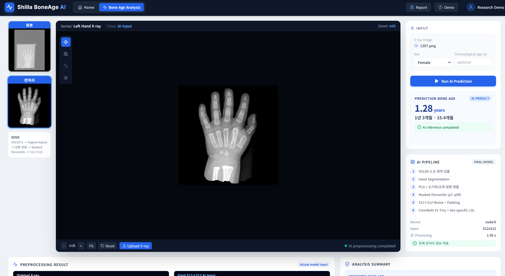
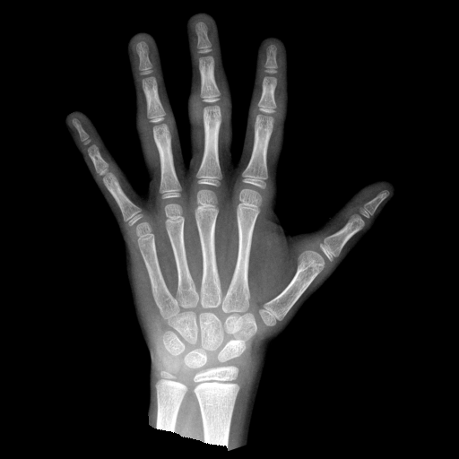
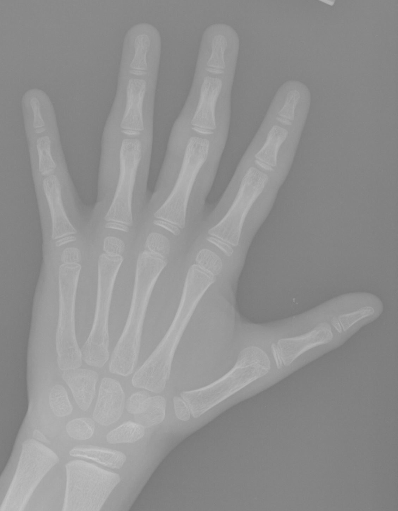
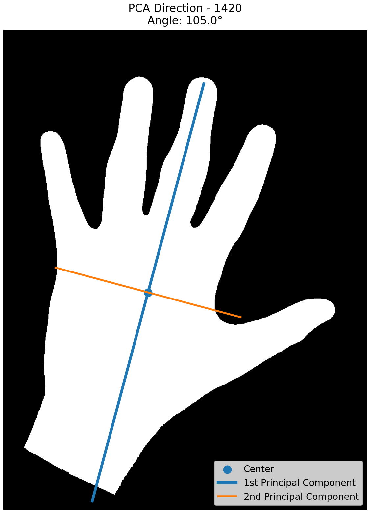
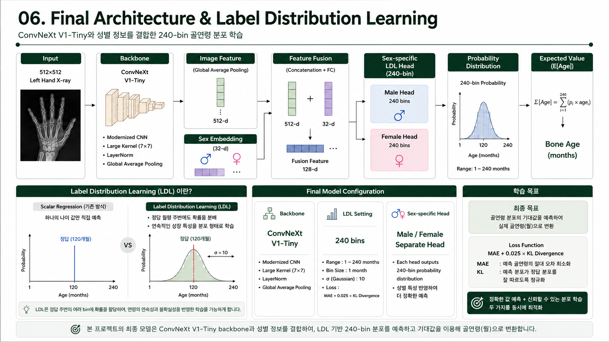

# Hand Bone Age Estimation

> **좌측 손 X-ray와 성별 정보를 입력받아 뼈나이(골연령, Bone Age)를 개월 단위로 예측하는 AI 프로젝트**
>
> 촬영마다 달라지는 손의 위치·크기·방향과 영상 명암을 자동으로 보정한 뒤, 표준화된 X-ray를 기반으로 뼈나이를 예측합니다.



---

## 1. Project Overview

소아의 뼈나이(골연령)는 성장 상태와 골격 성숙도를 판단하는 데 활용됩니다.

하지만 실제 손 X-ray는 촬영 환경에 따라 **손의 위치·크기·방향, 명암, 배경이 서로 다를 수 있어** 모델 입력의 편차가 커질 수 있습니다.

본 프로젝트에서는 단순히 영상의 밝기와 대비를 보정하는 데 그치지 않고, **손 영역을 자동으로 찾고 방향과 크기를 일정하게 맞추는 입력 표준화 파이프라인**을 구축한 뒤 뼈나이 예측 모델과 연결했습니다.

### 핵심 흐름

```text
좌측 손 X-ray
    ↓
손 영역 자동 검출
    ↓
손 모양 분리
    ↓
손 방향 자동 정렬
    ↓
512×512 입력 표준화
    ↓
X-ray 영상 특징 + 성별 정보 분석
    ↓
뼈나이 예측 (개월)
```

### 사용 기술

- **YOLOX-S**: 손 영역 검출
- **DeepLabV3-MobileNetV3-Large**: 손 영역 Segmentation
- **PCA 기반 정렬**: 손가락/손목 방향 보정
- **Masked Percentile + Background Removal**: 명암 및 배경 표준화
- **ConvNeXt V1-Tiny + Sex-specific Label Distribution Learning**: 뼈나이 예측

---

## 2. My Contribution

**7인 팀 프로젝트**에서 다음 영역을 담당했습니다.

- 손 X-ray 데이터 전처리 및 입력 표준화 파이프라인 구축
- YOLOX-S 기반 손 영역 검출 실험
- Segmentation mask 기반 손 영역 분리 및 PCA 방향 정렬
- ConvNeXt 기반 뼈나이 예측 모델 개발
- 성별 정보를 결합한 예측 구조 및 Label Distribution Learning 적용
- 전처리 / Backbone / Loss / Attention / ROI 구조 비교 실험
- Validation 및 Held-out Test 성능 분석
- 성별·연령 구간별 오류 및 Bias 분석

---

## 3. Problem Solving

### 3.1 초기 가설: 명암 보정이 성능을 높일 수 있을까?

프로젝트 초반에는 CLAHE, Percentile normalization 등 여러 명암 보정 방법을 적용했습니다.

그러나 실험 결과 **개선 폭이 매우 작거나 오히려 성능이 낮아지는 경우도 있어**, 명암 보정만으로는 충분하지 않다고 판단했습니다.

### 3.2 데이터 재분석: 영상마다 손의 위치와 방향이 달랐습니다

원본 X-ray를 다시 확인한 결과 영상마다 다음과 같은 차이가 존재했습니다.

- 손의 위치
- 손의 크기
- 촬영 방향과 회전
- 명암과 배경

이에 따라 모델이 골격 특징 외의 불필요한 입력 차이까지 함께 학습할 수 있다고 판단했습니다.

### 3.3 개선 방향: 손 자체를 기준으로 입력을 표준화

```text
Raw X-ray
    ↓
YOLOX-S로 손 위치 검출
    ↓
Segmentation으로 손 영역 분리
    ↓
PCA로 손의 주 방향 추정
    ↓
손가락/손목 방향 확인 후 정렬
    ↓
명암 정규화 + 배경 제거
    ↓
512×512 입력 생성
```

이 과정을 통해 촬영 조건이 달라도 모델에는 가능한 한 일정한 형태의 손 X-ray가 입력되도록 구성했습니다.



---

## 4. Final Performance

### Bone Age Prediction — Held-out Test

최종 모델 선택이 완료된 이후, 모델 및 하이퍼파라미터 선택에 사용하지 않은 **Held-out Test 197건**을 1회 평가했습니다.

| Metric | Result |
|---|---:|
| N | 197 |
| MAE | **4.245 months** |
| RMSE | **5.412 months** |
| R² | **0.9837** |
| Bias | +0.794 months |
| Median AE | 3.279 months |
| P90 AE | 8.688 months |
| P95 AE | 10.452 months |
| Max AE | 17.581 months |

> Held-out Test 결과는 모델 선택이나 하이퍼파라미터 조정에 다시 사용하지 않았습니다.

### Hand Detection — YOLOX-S

| Metric | Result |
|---|---:|
| mAP@0.5:0.95 | **99.4%** |
| AP@0.5 | **100.0%** |

### Hand Segmentation

| Metric | Result |
|---|---:|
| Dice | **98.67%** |
| IoU | **97.38%** |

---

## 5. Input Standardization Pipeline

### 5.1 Hand Detection — YOLOX-S

YOLOX-S를 이용해 X-ray에서 손 영역을 검출하고 Segmentation 입력용 ROI를 추출했습니다.

```text
src/detection/yolox_s_hand_exp.py
```



### 5.2 Hand Segmentation

DeepLabV3-MobileNetV3-Large를 이용해 손 영역 mask를 생성했습니다.

```text
src/segmentation/train_hand_segmentation.py
```


### 5.3 PCA-based Alignment

Segmentation mask의 손 영역 좌표를 이용해 PCA 주축을 계산하고, 손가락과 손목 방향을 추가로 확인해 손 방향을 정렬했습니다.

```text
src/preprocessing/create_seg_aligned_dataset.py
```



### 5.4 Final 512×512 Input

정렬된 손 영상에는 다음 처리를 적용했습니다.

1. Segmentation mask의 손 영역 내부에서 P1 / P99 계산
2. P1-P99 범위를 0-255로 선형 정규화
3. Aspect ratio를 유지해 resize
4. 512×512 center padding
5. Mask 약 3 px dilation
6. Dilated mask 밖 배경을 0으로 제거

```text
src/preprocessing/create_final_512_input.py
```

배경 제거는 단독 성능 향상을 위한 기법이라기보다, 촬영 환경에 따른 비손 영역의 영향을 줄이고 최종 입력 형식을 일관되게 만들기 위한 표준화 단계로 사용했습니다.

---

## 6. Bone Age Prediction Model

최종 뼈나이 예측 모델의 Backbone은 **ConvNeXt V1-Tiny (`convnext_tiny.fb_in1k`)** 입니다.

```text
512×512 X-ray
      ↓
ConvNeXt V1-Tiny
      ↓
Image Feature 512-d
      +
Sex Embedding 32-d
      ↓
Fusion Feature 128-d
      ↓
Male / Female Separate 240-bin Head
      ↓
Expected Bone Age (months)
```



### Sex Information

성별 값은 단순한 숫자로 직접 붙이지 않고 Embedding을 통해 feature로 변환한 뒤 영상 특징과 결합했습니다.

### Sex-specific Head

Fusion feature는 성별에 따라 서로 다른 240-bin prediction head로 전달됩니다.

```text
Male   → Male 240-bin Head
Female → Female 240-bin Head
```

각 bin은 1~240개월을 의미하며, 최종 뼈나이은 예측 확률분포의 기대값으로 계산합니다.

---

## 7. Label Distribution Learning

일반적인 단일값 회귀(Scalar Regression)는 하나의 정답 나이를 직접 맞추도록 학습합니다.

본 프로젝트에서는 정답 나이 하나만 독립적인 값으로 보지 않고, **정답 주변 연령도 서로 가까운 값이라는 연속적인 관계를 학습하도록 Label Distribution Learning(LDL)** 을 적용했습니다.

예를 들어 정답이 120개월이라면 120개월에만 정답 신호를 주는 것이 아니라, 주변 연령에도 Gaussian 형태의 확률을 분배해 정답 분포(Target Distribution)를 구성합니다.

- Number of bins: 240
- Range: 1–240 months
- Gaussian sigma: 10
- KL weight: 0.025

### Loss

```math
\mathcal{L} = MAE_{\text{month}} + 0.025 \times D_{KL}(G \parallel P)
```

- **MAE**: 실제 뼈나이 오차를 최소화
- **KL Divergence**: 예측 연령 분포가 정답 주변의 Gaussian 분포를 따르도록 학습

즉, 실제 뼈나이 오차를 줄이는 동시에 예측 확률분포가 정답 주변의 연령 분포를 따르도록 학습했습니다.

```text
src/bone_age/train_bone_age_ldl.py
```

---

## 8. Error Analysis & Bias Refinement

전체 Validation MAE만 확인하지 않고 **성별 × 연령 구간**으로 오류를 나누어 분석했습니다.

분석 결과 저연령 남아 구간에서 상대적으로 큰 과대예측 편향(Positive Bias)이 확인되어, 전체 모델을 다시 학습하는 대신 **Male LDL Head만 선택적으로 미세조정(Targeted Fine-tuning)**하는 실험을 진행했습니다.

### Trainable Scope

```text
Frozen
├─ ConvNeXt backbone
├─ image_head
├─ sex_embedding
├─ fusion_trunk
└─ female_output

Trainable
└─ male_output
```

### Refinement Objective

- 모든 Male sample: 기존 LDL objective 유지
- Male ≤ 60 months: Positive group-bias penalty
- Male > 60 months: Base-model teacher consistency
- Female branch: Frozen

Validation에서 Male ≤60 months:

| Metric | Result |
|---|---:|
| MAE | 5.880 months |
| Bias | +3.528 months |

```text
src/bone_age/train_male_bias_refinement.py
```

---

## 9. Model Experiments

단순히 Backbone만 변경하지 않고 전처리, Loss, Attention, Local ROI, Residual Fusion, Sex Conditioning, Bias Regularization 등 여러 방향을 비교했습니다.

| Experiment | Val MAE | Val RMSE | Decision |
|---|---:|---:|---|
| Core Sex-specific LDL | 5.842 | 8.118 | Core architecture |
| Weak CDF Regularization | 5.807 | 8.090 | Small gain |
| Spatial Attention Prior | 5.818 | 8.091 | Not selected |
| Whole-hand + Upper ROI Residual Fusion | 5.788 | 8.066 | Higher complexity |
| Young-Male Bias Refinement | 5.825 | 8.105 | **Final selected** |
| 768×512 Resolution Ablation | 5.989 | 8.421 | Rejected |

Validation MAE가 가장 낮았던 Residual Fusion은 Whole-hand와 Local ROI Expert를 동시에 사용해야 했습니다.

개선 폭에 비해 Inference 구조가 복잡해졌기 때문에, 최종 배포에서는 **단일 Whole-hand 구조를 유지하면서 Subgroup Bias를 직접 보완한 Targeted Refinement**를 선택했습니다.

전체 실험 기록:

- [`experiments/README.md`](experiments/README.md)
- [`experiments/experiment_summary.csv`](experiments/experiment_summary.csv)

---

## 10. Dashboard

학습된 모델을 실제 추론 흐름으로 확인할 수 있도록 Dashboard를 구성했습니다.

```text
X-ray Upload
    ↓
Hand Detection
    ↓
Hand Segmentation
    ↓
PCA Alignment
    ↓
Input Standardization
    ↓
ConvNeXt + Sex-specific LDL
    ↓
Bone Age Prediction
```


배포용 모델 weight:

```text
app/backend/model_package/models/
├─ best_model.pt
├─ hand_seg_crop512_traced.pt
└─ yolox_s_hand_best.pth
```

모델 weight는 Git LFS로 관리합니다.

---

## 11. Repository Structure

```text
hand-bone-age-estimation/
├─ README.md
├─ requirements.txt
├─ .gitignore
├─ .gitattributes
│
├─ src/
│  ├─ detection/
│  │  └─ yolox_s_hand_exp.py
│  ├─ segmentation/
│  │  └─ train_hand_segmentation.py
│  ├─ preprocessing/
│  │  ├─ create_seg_aligned_dataset.py
│  │  └─ create_final_512_input.py
│  └─ bone_age/
│     ├─ train_bone_age_ldl.py
│     ├─ train_male_bias_refinement.py
│     └─ evaluate_bone_age.py
│
├─ app/
│  ├─ backend/
│  ├─ frontend/
│  └─ run_all.bat
│
├─ assets/
│  ├─ raw_xray.png
│  ├─ yolo_roi_crop.png
│  ├─ segmentation_mask.png
│  ├─ pca_axis_estimation.png
│  ├─ aligned_mask.png
│  ├─ final_512_input.png
│  ├─ model_architecture.png
│  └─ dashboard.png
│
├─ experiments/
│  ├─ README.md
│  └─ experiment_summary.csv
│
├─ results/
│  └─ heldout_test/
│
└─ docs/
   └─ hand_bone_age_portfolio.pdf
```

---

## 12. Installation

### Python Environment

```bash
python -m venv .venv
```

Windows:

```bash
.venv\Scripts\activate
```

Linux / macOS:

```bash
source .venv/bin/activate
```

Install dependencies:

```bash
pip install -r requirements.txt
```

GPU acceleration is supported through PyTorch CUDA.  
CUDA-enabled PyTorch는 사용 중인 NVIDIA driver / CUDA 환경에 맞는 build를 설치하는 것을 권장합니다.

---

## 13. Training & Evaluation

### Bone Age Core Model

```bash
python src/bone_age/train_bone_age_ldl.py
```

### Male Bias Refinement

```bash
python src/bone_age/train_male_bias_refinement.py
```

### Held-out Test

최종 모델 선택이 완료된 뒤:

```bash
python src/bone_age/evaluate_bone_age.py
```

> Held-out Test 결과를 사용해 다시 모델을 선택하거나 하이퍼파라미터를 조정하지 않습니다.

---

## 14. Preprocessing

### Step 1 — Detection / Segmentation / Alignment

```bash
python src/preprocessing/create_seg_aligned_dataset.py --split all
```

### Step 2 — Final 512×512 Input

```bash
python src/preprocessing/create_final_512_input.py
```

원본 의료영상과 학습 데이터셋은 repository에 포함하지 않습니다.

---

## 15. Portfolio

[View Project Presentation](docs/hand_bone_age_portfolio.pdf)

---

## Notes

- 본 저장소는 프로젝트의 전처리, 모델 학습, 평가, Inference Pipeline을 재구성할 수 있도록 정리했습니다.
- 원본 의료영상 및 학습 데이터셋은 저장소에 포함하지 않습니다.
- `outputs/`는 학습 및 전처리 과정의 중간 결과이므로 `.gitignore`에서 제외합니다.
- 공개 최종 평가 결과는 `results/heldout_test/`에 보관합니다.
- 모델 weight는 `app/backend/model_package/models/`에서 inference에 사용됩니다.

---

## Disclaimer

본 프로젝트는 **연구·교육 및 포트폴리오 목적**으로 개발되었습니다.  
의료진의 임상 판단을 대체하거나 실제 진단 목적으로 사용하기 위한 의료기기가 아닙니다.
